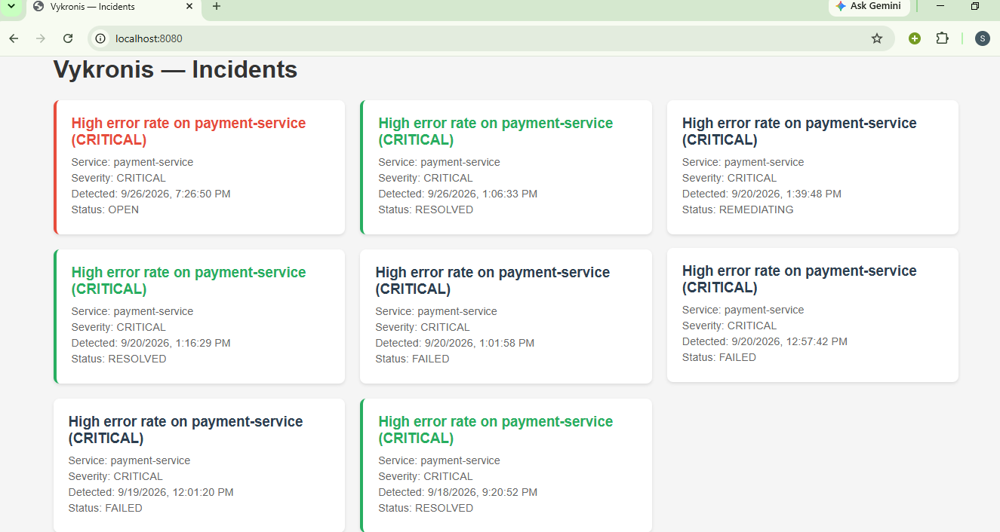
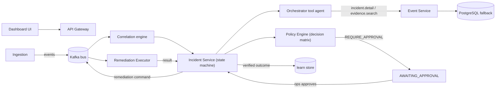

# Vykronis — Autonomous Incident Response Platform

**A self-healing operations platform: it detects an anomaly, investigates the root cause with
a tool-constrained agent, blocks or authorizes every action through a fail-closed policy engine,
remediates production only with a human approver in the loop, and records what it learned.**

> Loop: **Observe → Detect → Investigate → Hypothesize → Authorize → Execute → Verify → Learn**

There is a lot of "AI ops" demo-ware out there. This is **not a dashboard, and not a chatbot.**
It is a working, closed-loop distributed system built on real streaming, real state machines,
and real policy — and its full loop is demonstrated end-to-end, on a single 8 GB laptop.

---

## Proof it works (pipeline demo, ~1 minute)

```bash
docker run -d --name probe --network vykronis_default curlimages/curl sleep 1800
docker cp infra/compose/demo-live.sh probe:/tmp/demo.sh
docker exec probe sh /tmp/demo.sh
```

Lifecycle of one incident, captured from a live run:

```
[burst]  14 PROD error-rate telemetry events injected into ingestion-service
[OPEN]   correlation-engine windows 60s of telemetry -> detects anomaly
[investigate] orchestrator tool agent runs incident.detail + evidence.search
         -> rule-based fallback hypothesis (AI provider absent) -> HYPOTHESIS_READY
[remediation] policy-service decision matrix (PROD rollback)
         -> REQUIRE_APPROVAL -> AWAITING_APPROVAL
[approve] human operator (ops / vykronis-approver) approves
         -> remediation command published on Kafka -> REMEDIATING
```

The state machine is enforced in the incident-service; every transition is persisted in
PostgreSQL. The demo runner logs each phase with live status polls (see `demo-live.sh`).

Applying that pressure live produces a board like this one — incidents born, investigated,
human-approved, and remediated against a running stream:

<figure>
  
  <figcaption>Live dashboard (no mock data): incidents on the board were driven by real telemetry through the full loop.</figcaption>
</figure>

## Engineering substance

| Question | What the code actually does |
|---|---|
| How are incidents born? | `ingestion-service` → Kafka → `correlation-engine` (60s windowed detection on `error_rate`) |
| How is root cause found? | `agent-orchestrator` runs a **tool-calling agent** over an allow-listed tool set (`incident.detail`, `evidence.search`); AI provider first, **deterministic rule-based fallback** (slowest-trace attribution) otherwise — it never fabricates evidence |
| What stops it from wrecking prod? | A **fail-closed decision matrix** in `policy-service`: service-to-service automation is DENIED for PROD; only a named human approver (`vykronis-approver`) can authorize → `REQUIRE_APPROVAL` |
| Where is the human gate? | `DEFAULT → AWAITING_APPROVAL → approve → REMEDIATING` — a real endpoint, a real actor model, an audit trail |
| What if infra is missing? | Search degrades to a Postgres fallback; investigation falls back to rules — the pipeline **does not hard-fail** |
| Does it close the loop? | `RemediationResultConsumer` advances `REMEDIATING → VERIFYING → RESOLVED` and writes to the learn store |

## Architecture



## Stack

Java 25 · Spring Boot 4 · Apache Kafka (KRaft) · PostgreSQL · Redis · Spring AI (pluggable:
Ollama local, or `none` → rule-based) · OpenTelemetry · OpenSearch (optional) · Next.js (optional UI) ·
Docker Compose / Helm-kind.

## Run it

One-time build — the shared slim jlink JRE base image and all service images:

```powershell
docker build -f infra/docker/runtime.Dockerfile -t vykronis/runtime:local .
docker compose -f infra/compose/docker-compose.yml -f infra/compose/docker-compose.apps.yml --profile apps build
```

Bring the stack up:

```powershell
# full stack (13 services)
docker compose -f infra/compose/docker-compose.yml -f infra/compose/docker-compose.apps.yml --profile apps up -d

# low-RAM hosts (9 services, terminal-only demo, logged to file)
powershell -ExecutionPolicy Bypass -File infra/compose/mini-up.ps1   # bring-up (needs the images built above)
powershell -ExecutionPolicy Bypass -File infra/compose/run-demo.ps1  # demo -> Notes\demo-logs\demo-*.log
```

Dashboard at `http://<docker-vm-ip>:8080/` (served by the gateway — no Node needed).

## Repository layout

```
contracts/                 Kafka contracts: events, commands, results (public models)
libs/common/               shared trace IDs, API errors, Kafka headers
platform/                  9 Spring Boot services (gateway, ingestion, event, correlation,
                           incident, orchestrator, policy, remediation, schema-registry)
infra/compose/             Docker Compose profiles + demo runner scripts
docs/                      design/phase docs; demo runbooks
ui/web/                    optional Next.js dashboard
demo/                      sample services producing telemetry
```

## Engineering notes

- Every container runs under a **memory budget** so the whole stack boots on a 7.9 GB laptop —
  a real constraint you can check in the compose files (`mem_limit` per service).
- Volumes hold all demo data — never `docker compose down -v` (the README respects it for you).
- `RESOLVED` (executor → verify hop) requires the `observability`/`search`/`ai` profiles —
  documented, deliberate, and present in the compose project.

## Status

Core pipeline **functional**: ingest → detect → investigate → policy → human approval →
remediation command → REMEDIATING, verified live. Remaining deploy steps (Kubernetes/CI,
AI-provider wiring, full RESOLVED with infra profiles) are documented in `docs/`.

---

© 2026 Sreelekha G. All rights reserved. See [LICENSE](LICENSE).